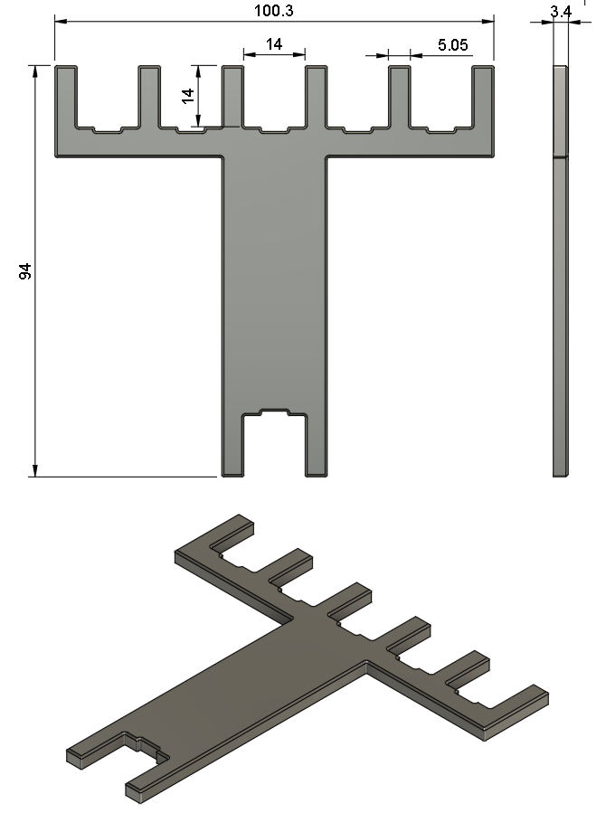

# Plate Fork

A keyboard build tool. The plate fork primarily prevents plates from flexing at switch insertion points.
Intended for usage with MX switches and 1.5mm plates.

# Fork Dimensions
Units: mm

# Notes

-All files are to be used at your own risk
